# FoodSecret
 
FoodSecret is an iOS app that helps you track your food consumption, monitor your calorie intake, and stay hydrated throughout the day. The app syncs with the Health app, making it easy for you to monitor your progress and reach your health goals.

## Features

- **Calorie tracking**: You can track your calorie consumption by meal and keep an eye on your daily intake.
- **Water tracking**: You can track the amount of water you drink throughout the day to ensure you stay hydrated.
- **Activity tracking**: With the app's step and activity tracking feature, you can stay on top of your physical activity and set goals to improve your health.
- **Recipe database**: The app has a recipe database sourced from Edamam's API, ensuring that you always have a wide variety of nutritious meals to choose from.
- **Food database**: The app also features a database of various foods and meals sourced from nutritionix.com, allowing you to easily log your meals.
- **Custom food creation**: You can create custom food items that aren't in the app's database and add them to your meal log.
- **Personalized profile**: You can customize your profile and weight loss goals to ensure that the app provides tailored advice and support.
- **Widgets**: The app offers handy widgets that provide quick access to your meal log and hydration tracker.

## Includes

- SwiftUI
- iOS 15+
- MVVM
- Combine
- Core Data
- Alamofire
- HealthKit
- NukeUI
- WidgetKit
- Custom view and animations
- Dark and light mode
- Two api are used (nutritionix.com, api.edamam.com)

## Video 📷

[Link to video demo](https://youtu.be/nqbsoBvWAAE)

## Screenshots 📷

 

 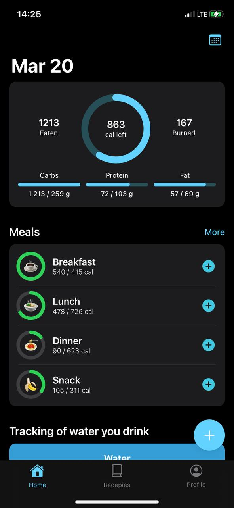
 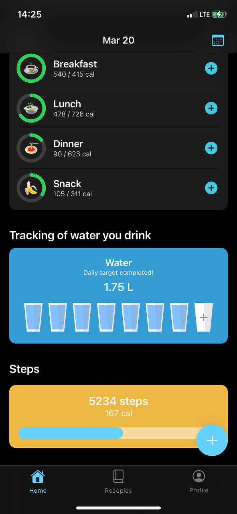
  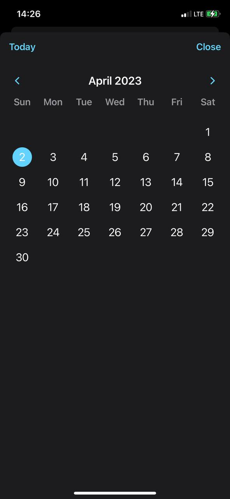
 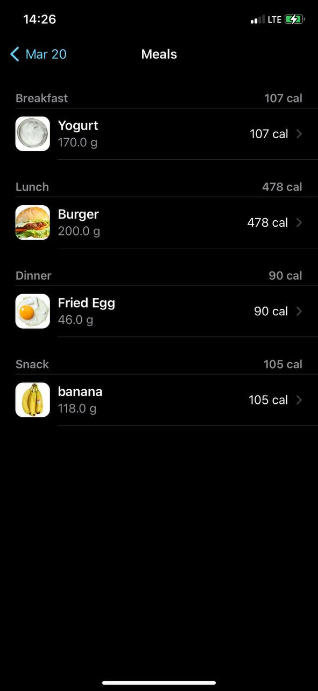
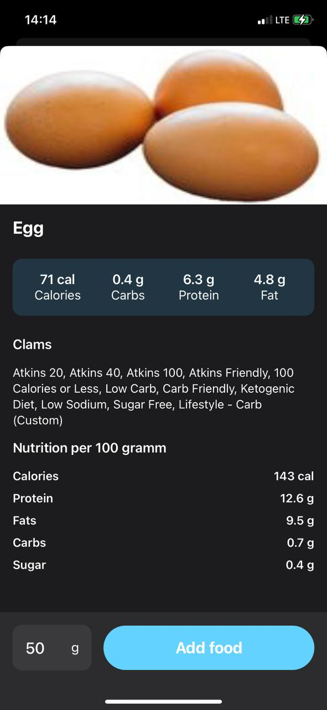
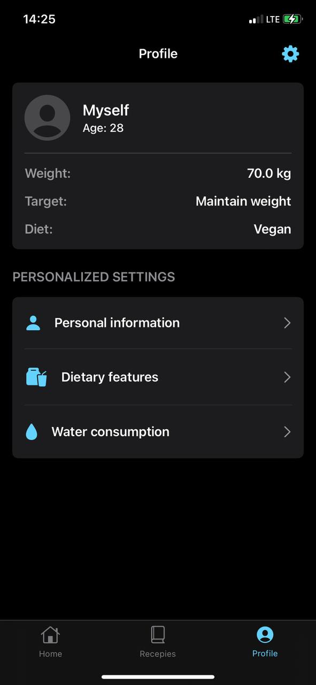
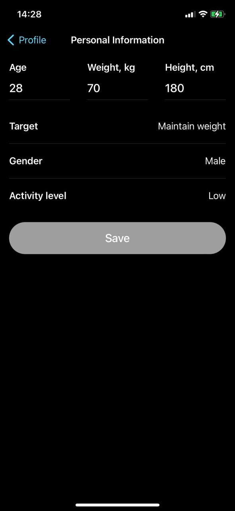
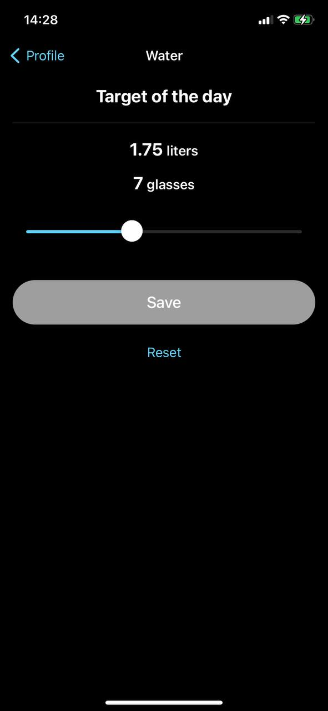
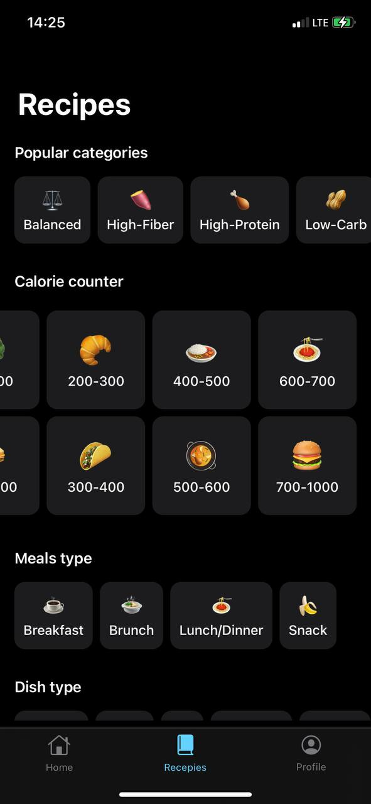
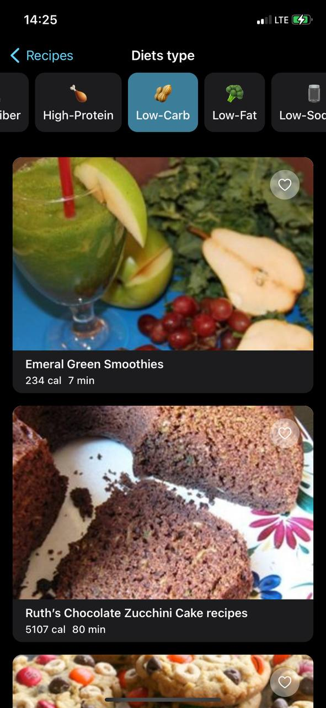

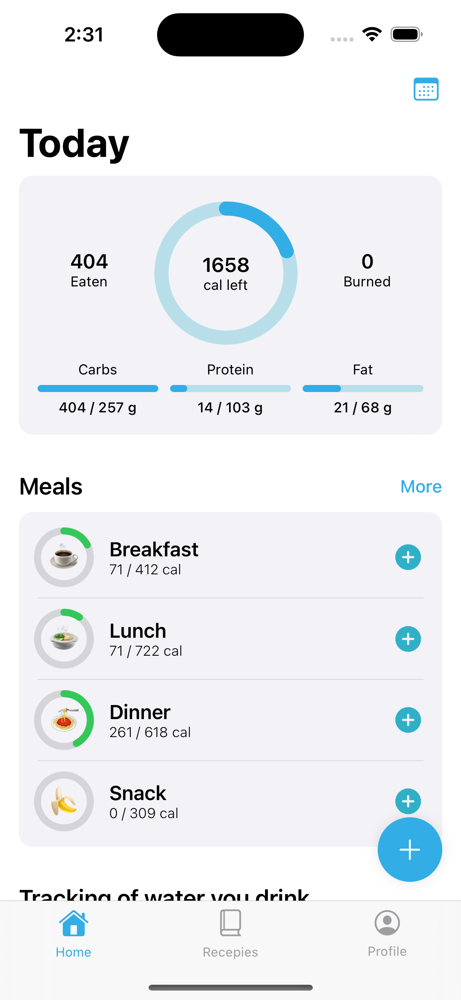
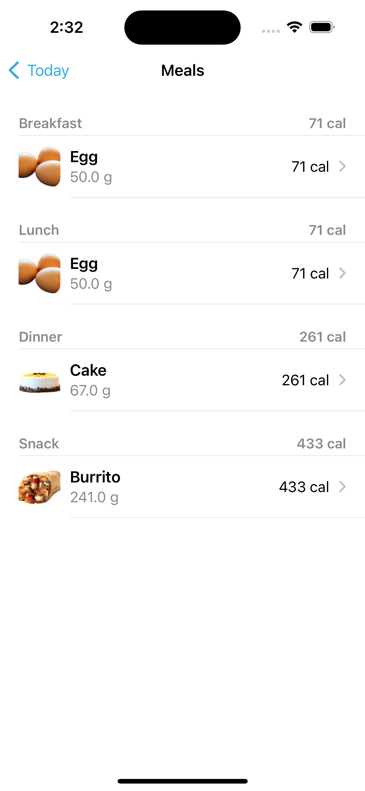
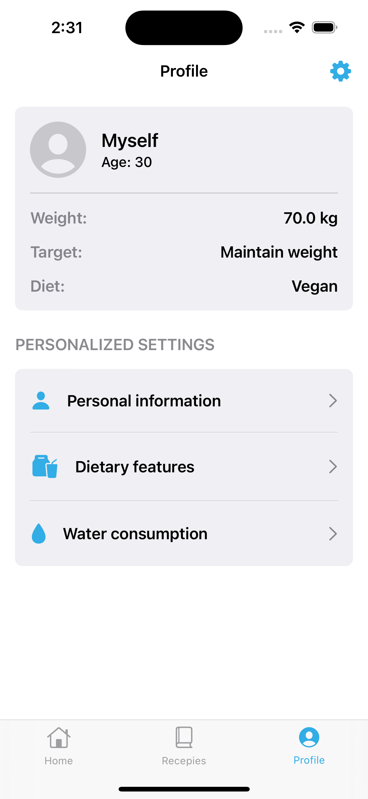
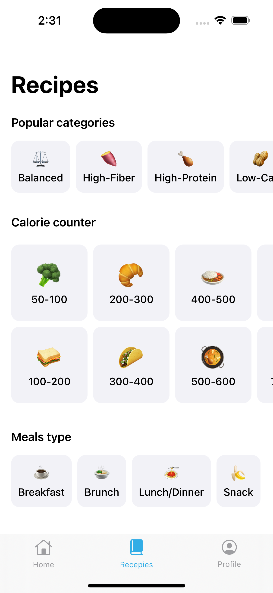

   

   
   ## Widgets 

 

 
 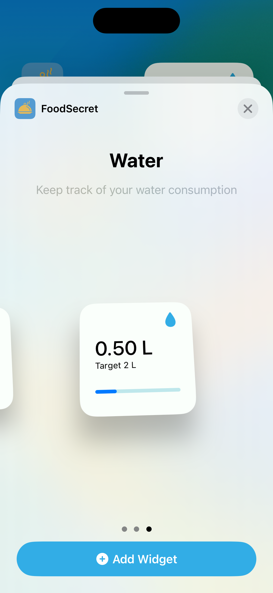
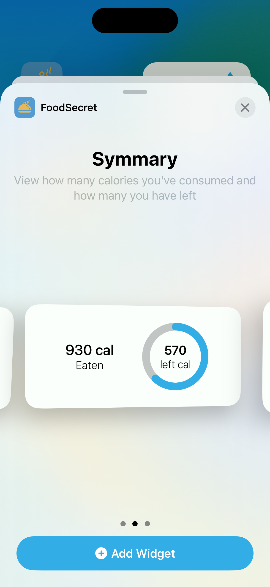
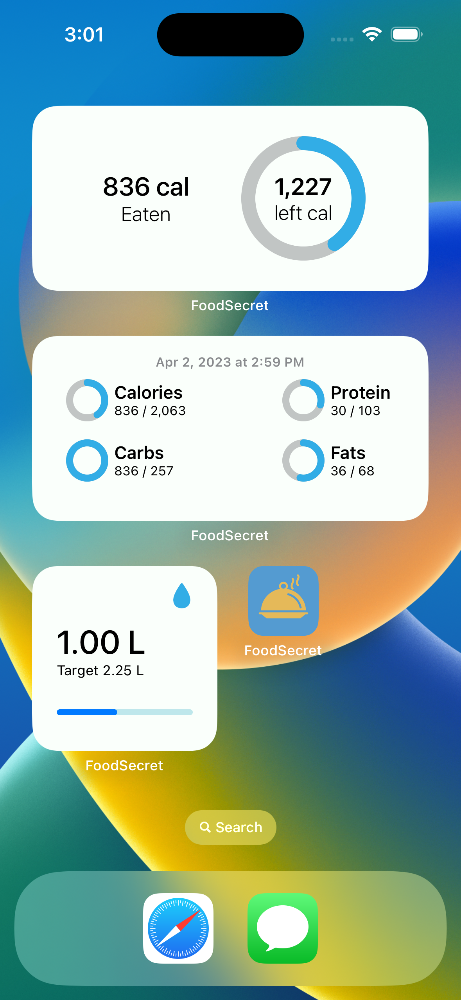
   

## Author
* [Bogdan Zykov](https://github.com/BogdanZyk)

###

